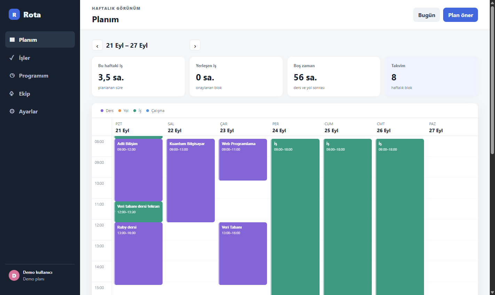
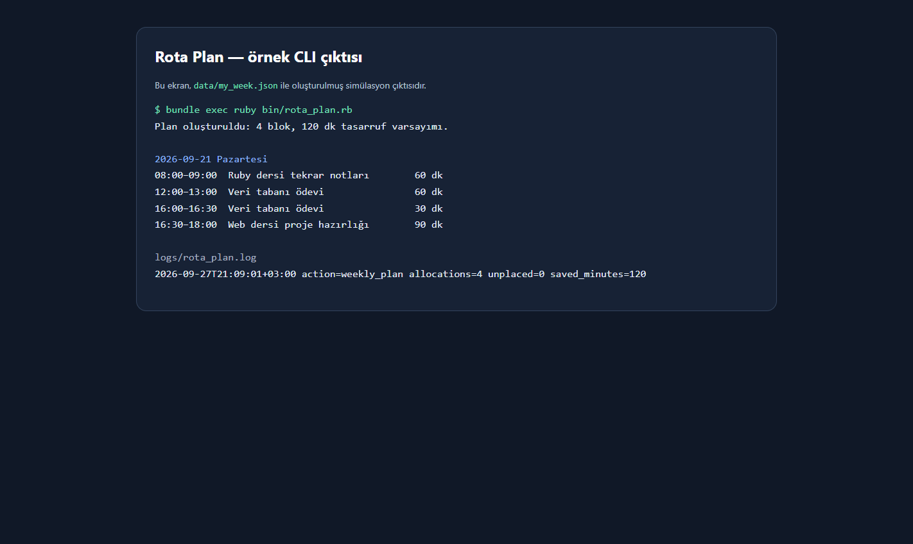

# Rota Plan

Rota Plan benim ders, iş ve ödev saatlerini tek haftalık dosyada birleştiren küçük bir Ruby CLI aracıdır. Pazartesi Adli Bilişim ve Ruby, salı Kuantum Bilgisayar, çarşamba Web Programlama ile Veri Tabanı; perşembe, cuma ve cumartesi iş saatleri arasında ödev için boşluk bulmakta zorlanıyorum. Şu an çirkin çözümüm ders programına, iş vardiyası mesajlarına ve notlarıma ayrı ayrı bakıp uygun saati elle aramak; bir görevi yazarken sonraki ders veya iş bloğunu kaçırabiliyorum. Araç bu blokları okuyup açık görevleri boş zamanlara yerleştiriyor, sonucu dosyaya yazıyor ve her çalışmada log oluşturuyor.

## Teslim özeti

Araç bir Ruby CLI'dır. Tek kullanıcı benim; kullanıcı sistemi, admin paneli veya ölçek anlatısı yoktur.

- Tek komut: `bundle exec ruby bin/rota_plan.rb`
- Test: `bundle exec ruby test_rota_plan.rb`
- Girdi: `data/my_week.json`
- Plan çıktısı: `data/plan_output.json`
- Çalışma logu: `logs/rota_plan.log`

Her çalıştırmada loga tarih, `weekly_plan` işlemi, yerleşen blok sayısı, yerleşmeyen iş sayısı ve dakika cinsinden sonuç yazılır.

## Örnek plan ve 2 saat varsayımı

`data/my_week.json`, bu haftanın ders/iş düzeniyle hazırlanmış örnek senaryodur. Manuel yöntemde ders programı, vardiya ve notlar arasında üç kez geçiş yapıp toplam **120 dakika** harcadığım varsayımını kullanır. Araç bu veriyi tek komutta plan çıktısına çevirdiği için örnek senaryoda **haftada 2 saat tasarruf** sonucu gösterir. Bu değer simülasyondur; gerçek kullanım sonucu değildir.





## Acı günlüğü: gerçek kayıt alanı

Ödevin istediği gerçek kullanım kanıtını son 7 gün içinden kendi notlarınla doldur. Sahte kayıt yerine bu tabloyu teslimden önce kendi ekran görüntüsü, mesaj veya dosya tarihlerinle tamamla.

| Tarih | Nerede takıldım? | Kayıp süre | Kanıt dosyası / bağlantısı |
| --- | --- | ---: | --- |
| `YYYY-AA-GG` | Ders, iş ve ödev saatlerini karşılaştırırken | `__ dk` | `docs/evidence/...` |
| `YYYY-AA-GG` | Uygun tekrar saatini elle ararken | `__ dk` | `docs/evidence/...` |
| `YYYY-AA-GG` | İş vardiyasıyla ödev son tarihini karşılaştırırken | `__ dk` | `docs/evidence/...` |

Araç en az beş gün kullanıldıktan sonra `logs/rota_plan.log` içindeki satır sayısını ve `saved_minutes` değerlerini bu tabloyla yan yana koy.

| Ölçüm | Değer |
| --- | ---: |
| Simülasyon planındaki manuel süre varsayımı | 120 dk / hafta |
| Simülasyon planındaki araç çalıştırma sayısı | 1 |
| Gerçek kullanım sayısı | `logdan doldur` |
| Gerçek kazanılan süre | `logdan doldur` |

## Kurulum ve çalıştırma

Ruby 3.1 veya üstü gerekir.

```powershell
bundle install
bundle exec ruby bin/rota_plan.rb
```

Çıktıyı görmek için:

```powershell
Get-Content data/plan_output.json
Get-Content logs/rota_plan.log
```

Kendi programını kullanmak için `data/my_week.json` içindeki ders, iş ve görev bloklarını değiştirip aynı komutu çalıştır.

## Test

```powershell
bundle exec ruby test_rota_plan.rb
```

Test, görevin gerçek bir boşluğa yerleştiğini ve her çalıştırmanın log satırı yazdığını kontrol eder.

## Kontrol ve onay

Araç boş zamanları kendi başına hesaplar ve taslak çalışma blokları üretir. Blokları takvime veya Supabase uygulamasına kalıcı olarak kaydetmeden önce ben sonucu kontrol ederim; çünkü dersin saati, iş vardiyası veya ödev önceliği son anda değişebilir.

## Web arayüzü

Bu repoda CLI dışında Supabase kullanan ayrı bir web arayüzü de var. Giriş sayfası `/`, ayrı ekranlar `/plan`, `/tasks`, `/program`, `/team` ve `/settings` URL'lerindedir. Yerelde çalıştırmak için:

```powershell
bundle exec ruby app.rb
```

Supabase kurulumu için önce [ana şema migration'ını](supabase/migrations/20260927164345_create_rota.sql), sonra [profil trigger migration'ını](supabase/migrations/20260927164517_add_profile_trigger.sql) çalıştır.
